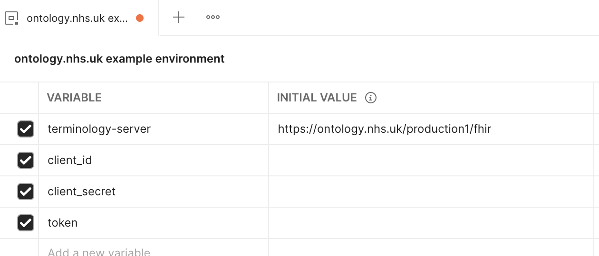
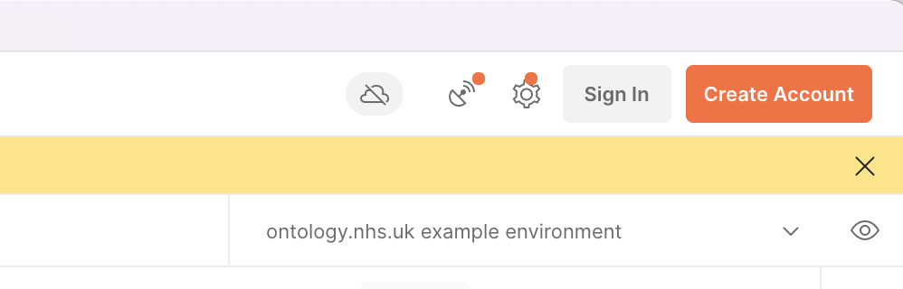

# NHS Digital Terminology Service Examples

This repository aims to provide a library of useful examples/code snippets to help users of the NHS Digital Terminology Server become more familiar with the basic functions and operations of the server. It should be used in conjunction with the documentation provided in the [terminology module of the FHIR standard](https://www.hl7.org/fhir/terminology-module.html), the [NHS Digital Terminology Service Information](https://digital.nhs.uk/services/terminology-servers) as well as the [Service Navigation and Status Information](https://ontology.nhs.uk).

[Postman](https://www.postman.com/downloads/) is a freely available api tool that can be useful for exploring the FHIR apis that the Terminology Server exposes but all the examples are also provided as codesnippets in various languages (including curl).

# Using Postman Collection:
The Postman Collection is configured to cache an access token in the `token` environment variable so that once a token has been obtained using the `Authentication/Obtain Token` request - this token is used by the other requests in the collection.

* [Import the Postman collection](https://learning.postman.com/docs/getting-started/importing-and-exporting-data/#importing-data-into-postman)
* [Import the Postman environment](https://learning.postman.com/docs/getting-started/importing-and-exporting-data/#importing-data-into-postman)
* Set the two placeholder variables for your credentials (`client_id` and `client_secret`) 
* Set your current environment to `ontology.nhs.uk example environment` 
* Send the Authentication/Obtain Token request 
* Run example requests
