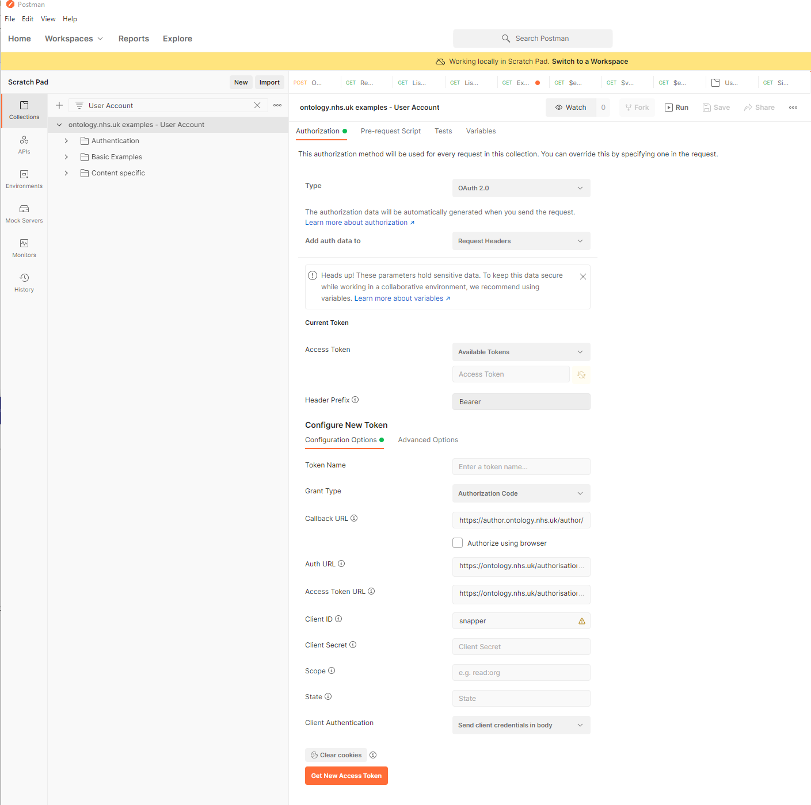
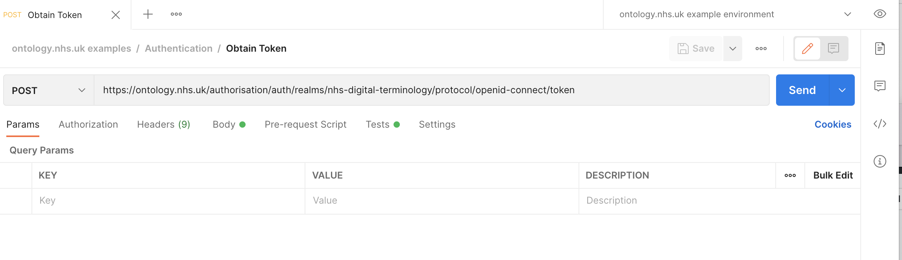

# NHS Digital Terminology Server Examples

This repository aims to provide a library of useful examples/code snippets to help users of the NHS Digital Terminology Server become more familiar with the basic functions and operations of the server. It should be used in conjunction with the documentation provided in the [terminology module of the FHIR standard](https://www.hl7.org/fhir/terminology-module.html), the [NHS Digital Terminology Server Information](https://digital.nhs.uk/services/terminology-servers).

[Postman](https://www.postman.com/downloads/) is a freely available api tool that can be useful for exploring the FHIR apis that the Terminology Server exposes but all the examples are also provided as codesnippets in various languages (including curl).

The Postman examples are provided in two separate collections and you should pick the appropriate one that matches the type of authentication method you are using. If you have a normal user account (self registered) then use the collection labelled `User Account`. If you have a System to system account (e.g. client_id/client_secret) then use the collection labelled `System Account`. The requests in the two collections are identical but they inherit authentication settings for the respective authentication types and have been provded as two separate collections for convenience so that they work out of the box.

# Using [Postman Collection With User Account](./postman/ontology.nhs.uk%20examples%20-%20User%20Account.postman_collection.json):
* [Import the Postman collection](https://learning.postman.com/docs/getting-started/importing-and-exporting-data/#importing-data-into-postman)
* [Import the Postman environment](https://learning.postman.com/docs/getting-started/importing-and-exporting-data/#importing-data-into-postman)
* You do not need to update any environment variables (the defaults are fine)
* Set your current environment to `ontology.nhs.uk example environment` 

* Select the parent folder of the postman collection: `ontology.nhs.uk examples - User Account`  
 
* Click the Orange Button labelled `Get New Access Token`
* A window will pop up asking for your login credentials - complete them and login
* Click Orange `Use Token` button
* Run example requests

# Using [Postman Collection With System to System Account](./postman/ontology.nhs.uk%20examples%20-%20System%20Account.postman_collection.json):
The Postman Collection is configured to cache an access token in the `token` environment variable so that once a token has been obtained using the `Authentication/Obtain Token` request - this token is used by the other requests in the collection.
* [Import the Postman collection](https://learning.postman.com/docs/getting-started/importing-and-exporting-data/#importing-data-into-postman)
* [Import the Postman environment](https://learning.postman.com/docs/getting-started/importing-and-exporting-data/#importing-data-into-postman)
* Set the two placeholder variables for your credentials (`client_id` and `client_secret`) 

* Set your current environment to `ontology.nhs.uk example environment` 

* Send the Authentication/Obtain Token request 

* Run example requests
